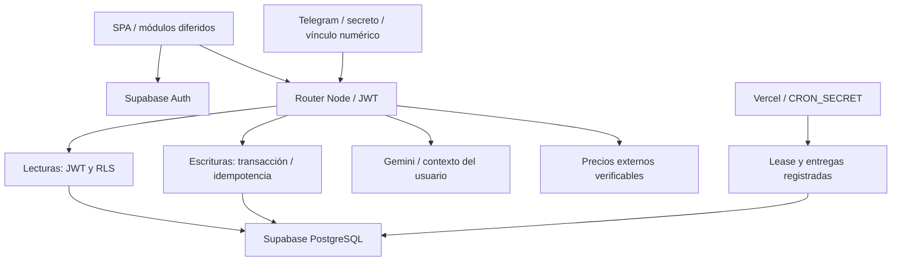
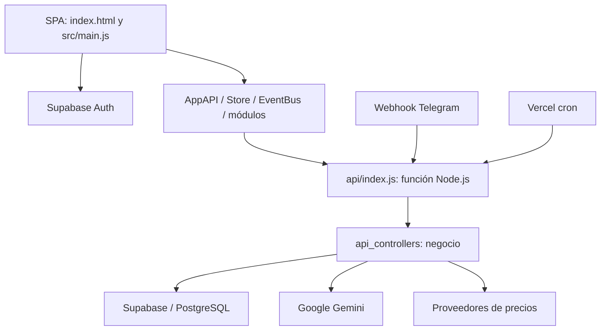

# Documentación maestra de Fluxo

Actualizada el **5 de octubre de 2026**, Argentina. Versión **6.2.0**. Base de auditoría: `62007ea`. Esta edición registra las correcciones implementadas y conserva al final el diagnóstico original para trazabilidad.

## Estado y alcance actuales

Fluxo es un gestor de finanzas personales: movimientos, recurrencias, cuotas, tarjetas, gastos compartidos, ahorro, inversiones, importación de resúmenes, asistente y bot. No ejecuta pagos bancarios ni órdenes de broker, ni administra pólizas/siniestros.

Se inspeccionaron código, documentación, configuración local, esquema efectivo de Supabase, columnas, relaciones, políticas, RPC, triggers e historial de migraciones. Se corrigieron las fallas de aislamiento y los flujos contables descritos abajo. No se atribuyen incidentes previos a los defectos encontrados.

**Supabase:** proyecto `ltmpajstmrcmxezpfusn`, región sa-east-1; migración registrada **20261005192629**, `fluxo_isolation_transactions_20261005`, aplicada. Los registros financieros existentes no se eliminaron ni se ajustaron por heurísticas. Las fixtures de verificación se revirtieron.

**GitHub/Vercel:** rama de implementación `codex/estabilizacion-fluxo`; integración con `gnpozzo/fluxo` y producción desde main en https://fluxo-delta.vercel.app. DATABASE_URL, CRON_SECRET y SUPABASE_URL configurados como Secret para producción y previews mediante sesión autenticada existente. Cada publicación debe confirmar READY y SHA. TELEGRAM_USER_LINKS configurado en producción para vincular al usuario de Telegram con la cuenta existente de Supabase. Compatibilidad con TELEGRAM_WEBHOOK_SECRET aplicada en ambas validaciones del webhook; recepción de /start y conversación con Gemini confirmadas por las capturas del usuario.

**Evidencia:** 16 pruebas Node, 19 comprobaciones PostgreSQL y 10 aserciones HTTP autenticadas en producción, con limpieza de identidad QA y registros. Sintaxis de archivos activos, build y auditoría de dependencias. Navegador sobre assets productivos con API simulada: login, carga diferida, siete módulos, configuración, CSP, tema y navegación móvil. No se probó OAuth real, envío de mensajes ni una sesión productiva autenticada de extremo a extremo.

## Arquitectura y responsabilidades

El router es una única función Node.js, con 52 controladores enrutados y un controlador de debug no publicado. `createMovimientosBatch` agrega un lote atómico de hasta 100 movimientos para la importación desde el asistente. No son microservicios Edge independientes.

Las lecturas usan cliente anon+JWT; la clave administrativa no sustituye la identidad humana. Las escrituras usan `pg`, TLS con CA pública de Supabase y login `fluxo_app`, miembro del rol limitado `fluxo_runtime`. Cada operación establece claims del usuario y `SET LOCAL ROLE authenticated` dentro de la transacción. El adaptador permite tablas/identificadores/operadores definidos y parametriza valores.

La clave administrativa queda reservada a sesiones del bot y recordatorios. El bot agrega filtros de propietario a sus consultas de negocio, y sus altas financieras normales usan el mismo wrapper transaccional. Algunas acciones del asistente conversacional todavía son escrituras independientes; ver límites operativos.

## Correcciones y comportamiento resultante

| Área | Cambio y resultado |
| --- | --- |
| RLS y RPC | Eliminadas políticas abiertas de perfiles, sesiones y recordatorios; propietario por identidad; RPC de lectura SECURITY INVOKER |
| Integridad de referencias | Trigger valida cuenta, tarjeta, categoría, subcuenta, contacto y origen del mismo usuario; propietario inmutable |
| Administración | Payloads acotados por campos y guardado con propietario; referencias ajenas no se reasignan |
| Atomicidad | Mutaciones web y altas financieras del bot confirman todo junto; errores revierten pasos previos |
| Idempotencia | Clave+usuario+endpoint+hash; replay de respuesta confirmada; conflicto 409 si cambia payload |
| Concurrencia | Lock transaccional por usuario; cron con lease durable; updates Telegram únicos |
| Consultas | Eliminados borrados/reparaciones/provisionamiento ad hoc desde getInitialData/getConsumosTC |
| Fechas | Calendario UTC civil, mes correcto, fin de mes no desborda; cuotas enero 31 → febrero 28 → marzo 31 |
| Movimientos | Moneda persistida, porcentajes validados, distribución conserva centavos; cuota con tarjeta crea consumo real |
| Edición | Movimiento inexistente devuelve 404; grupos se derivan del registro propio; reemplazo y alta comparten transacción |
| Tarjetas | Pago por período y moneda; pagos parciales acumulan selección previa sin duplicar asiento; totales oficiales solo cuando corresponden al período y resumen completo |
| Reintegros | Se generan al pagar; compensación de ingresos vinculados históricos para evitar contabilizarlos dos veces |
| Compartidos | Porcentaje 0 válido; si paga YO, saldo es parte ajena; RPC y JS concordantes |
| Ahorro | Saldo acumulado hasta fechaFin, cuenta desde movimiento de origen; ARS/USD separados; eliminación correcta con FK cascade |
| Inversiones | Costo promedio cronológico; venta reduce costo antes de recomprar; sobreventa revierte; tenencias separadas por moneda |
| Cambio y mercado | Eliminados valores ficticios; USD contable requiere tasa explícita o registrada reciente; precio sin moneda/fecha válida no genera valuación |
| Dashboard | KPIs ARS y USD separados; históricos paginados; no convierte con tasas predeterminadas |
| IA | Contexto por usuario/cuenta; datos faltantes no se inventan; HTML sanitizado; historial/objetivos y caches aislados |
| Resúmenes importados | Fechas históricas conservadas; límites de tamaño/tipo; fecha ausente se rechaza en lugar de inventarla |
| Auth | Listener permanente, recordar sesión con storage efectivo, invalidación al cambiar identidad y logout |
| Cliente HTTP | Retry limitado para lecturas; no repite escrituras por 500; refresh conserva clave; deduplicación sin recursión |
| Seguridad frontend | CSP sin scripts embebidos ni handlers HTML; DOMPurify; secretos solo servidor; sourcemaps productivos desactivados |
| UX | Foco de modal y trap de Tab; delegación de acciones admin; menú móvil sin superposición de botones |
| Rendimiento | Módulos diferidos; principal 149,15 kB / gzip 44,73, frente a 584,90 kB original; vendors adicionales separados |
| Dependencias/CI | Vite 7.3.6, SheetJS oficial 0.20.3, DOMPurify; 0 alertas npm audit; checks en GitHub Actions |
| SQL legado | Bootstrap potencialmente destructivo retirado; scripts antiguos no se ejecutan como reparación rutinaria |

### Reglas contables que conserva la aplicación

- Importe de alta positivo y finito; tipo de ingreso/egreso determina el signo. Las notas de crédito con importe negativo requieren un flujo explícito y no deben forzarse como compras positivas.
- Cuotas y recurrencias son registros anticipados, no ejecución de pagos. La fecha enviada debe representar el período que el usuario quiere registrar.
- Gastos de tarjeta imputados y pago del resumen se relacionan; el dashboard excluye los asientos CAT_PAGO_TC para evitar sumar ese flujo como gasto operativo adicional.
- Pago de resumen no acredita transferencia bancaria. El estado sigue siendo JSON en `logs`, limitado al propietario.
- En USD, el importe nativo permanece separado del importe ARS de contrapartida. La tasa contable se informa o se obtiene de un registro reciente; no se utiliza una constante.
- Ahorro consolidado sin cambio confiable y portfolio sin precio verificable devuelven valores no disponibles, no saldos fabricados.

## Base de datos: migración aplicada

Archivo: `supabase/migrations/20261005192629_fluxo_isolation_transactions_20261005.sql`.

1. RLS por propietario y acceso de lectura a categorías globales.
2. RPC invoker con search_path fijo y corrección del saldo compartido.
3. Trigger de propiedad y validación de relaciones nuevas/modificadas.
4. Índices por propietario, cuenta/fecha, tarjeta y recordatorios activos.
5. Esquema privado `fluxo_private` sin acceso anon/authenticated; requests, updates Telegram, entregas y leases del cron.
6. Permisos mínimos del runtime y provisionamiento de nuevos usuarios sin nombre personal hardcodeado.

No se revalidaron/repararon masivamente referencias históricas. Una limpieza de registros previos debe partir de un reporte y criterios explícitos, sin heurísticas automáticas al abrir pantallas.

La conexión runtime fue creada y verificada con TLS. `fluxo_runtime` es un rol de permisos sin login; `fluxo_app` es el login limitado que hereda esos permisos y puede establecer el rol authenticated. Se reemplazó el login inicial para evitar caché de credenciales del pooler después de rotarlo. Su contraseña está en `.env.db`, ignorado por Git. Los tokens administrativos no son parte de la migración ni del código. La migración presupone el esquema anterior: falta un baseline completo para instalación vacía.

## Pruebas y resultados

| Comprobación | Resultado y límites |
| --- | --- |
| `npm test` | 16 casos: retry, deduplicación, refresh, sesión/caché, fechas, reparto, inversión, validación, cron y transacciones |
| `npm run test:integration` | 19 aserciones reales: idempotencia, cuotas, rollback por referencias/sobreventa, ahorro USD, borrado, TC ARS/USD, edición inexistente y pagos parciales/reintegros USD |
| HTTP productivo | 10 aserciones contra fluxo-delta.vercel.app sobre 65ab3f7; identidad efímera, login, alta, replay, conflicto, consulta, validación y borrado; limpieza final confirmada |
| RLS A/B/anon | Script SQL sintético con rollback: aislamiento, referencias cruzadas y permisos RPC comprobados |
| Runtime | Conexión TLS y rol; sin claims no ve cuentas; acceso privado según grants |
| `npm run test:browser` | Assets compilados y CSP real con API simulada; login, siete módulos, menú móvil y tema; no reemplaza prueba de sesión real |
| `npm run check` / build | Sintaxis de 97 archivos activos y compilación sin advertencia del bundle principal grande |
| `npm audit` | 0 alertas reportadas; no implica ausencia de vulnerabilidades desconocidas |

`tests/` contiene regresiones; `scripts/verify-supabase.js` revierte su transacción externa en finally. No usar el token administrativo en CI. Capturas y snapshots locales están en `.audit.local/` y no se versionan.

## Operación, configuración y publicación

Consultar README y `.env.example`. Variables nuevas obligatorias para mutaciones/cron: `DATABASE_URL` y `CRON_SECRET`. Telegram requiere `TELEGRAM_SECRET_TOKEN` (o el nombre legado `TELEGRAM_WEBHOOK_SECRET`) y `TELEGRAM_USER_LINKS`, por ID numérico a UUID real. `TELEGRAM_ALLOWED_USERS` por sí solo no vincula identidades.

El webhook se registra con el secreto de Telegram en `secret_token`, no mediante una URL que exponga credenciales. El cron valida Bearer y corre a las 06:00 Argentina. Configurar las mismas variables del servidor en los entornos Vercel utilizados; la conexión no debe ser un login administrador.

Publicación: verificar CI/build, cargar variables, desplegar el commit revisado, esperar READY y comprobar SHA, configuración/Auth y flujo financiero. Un despliegue sin DATABASE_URL rechaza mutaciones con 503; no debe promoverse como operativo.

Supabase ya está migrado. El despliegue productivo 65ab3f7 fue observado READY, con pruebas HTTP aprobadas; las actualizaciones posteriores de documentación deben verificar nuevamente SHA/READY. Los workflows de GitHub estaban queued al cerrar la verificación, sin un resultado CI remoto que pueda atribuirse como aprobado. Para rollback, revisar compatibilidad antes de volver a código anterior: ese código puede volver a usar service role y eludir protecciones. Los scripts de bootstrap retirados no son un mecanismo de rollback.

## Límites y trabajo que necesita decisiones o evidencia adicional

- Falta una entidad histórica de resumen por tarjeta/período. La versión evita aplicar el total mutable actual a meses anteriores, pero no puede reconstruir un documento histórico inexistente.
- Las fuentes de mercado pueden no cubrir CEDEAR/bonos/tickers locales. Se requiere identificar mercado, moneda y eventualmente ratio; ante ambigüedad se muestra precio no disponible.
- El calendario de días hábiles excluye sábado/domingo, sin feriados nacionales. Debe definirse jurisdicción antes de agregar ese calendario.
- Algunas ediciones y bajas conversacionales del bot siguen separadas de la escritura de su sesión; no se probó una conversación completa ni entrega externa.
- Telegram no permite garantizar exactamente una entrega ante timeout: se conservan entregas pending y updates reclamados para conciliación, evitando repetir automáticamente resultados inciertos.
- Retención de registros de idempotencia/updates/entregas necesita una política de producto y tarea de mantenimiento; actualmente no se borran automáticamente.
- No se certificaron backups/restauración, OAuth/configuración remota completa, pruebas móviles exhaustivas, carga concurrente representativa, alertas operativas ni cumplimiento regulatorio.
- Importación IA necesita fixtures de documentos representativos y confirmación humana; la sanitización/validación no demuestra exactitud semántica de cada resumen.

## Auditoría original — evidencia anterior a las correcciones

Las secciones que siguen describen **exclusivamente el commit base 62007ea, antes de implementar los cambios**. Sus referencias a defectos pendientes, falta de acceso o ausencia de migraciones/deploy corresponden a ese momento. Para el estado vigente usar las secciones anteriores; se conserva este texto como trazabilidad del análisis solicitado.

### 1. Diagnóstico y alcance

Fluxo cubre una parte amplia de la gestión financiera personal: cuentas, movimientos, recurrencias, cuotas, tarjetas, gastos compartidos, ahorro, portfolio e IA. La SPA compila y la separación inicial frontend/backend permite continuar el producto. Hay controles útiles de autenticación y propiedad en numerosas consultas y eliminaciones.

La prioridad es mejorar **confiabilidad de la información y aislamiento de usuarios**. El código mezcla lecturas con reparaciones de datos, operaciones contables con escrituras independientes y autorización manual sobre un cliente administrativo. Estos patrones pueden modificar información legítima, operar sobre entidades ajenas o informar éxito después de un fallo.

Estado general: aplicación funcional con deuda técnica significativa. La evidencia disponible no permite considerarla preparada para operar como banca online o registro financiero confiable de múltiples clientes sin resolver los hallazgos prioritarios. No se necesita demostrar una reescritura en otro framework para abordar estos problemas.

#### Alcance y límites de la verificación

- Inventario, historial reciente, documentación del sistema y manual de usuario en Markdown.
- Entrada HTML/JS, servicios, componentes, los siete módulos y sus flujos de negocio.
- Router con **55 casos**, equivalentes a **51 controladores enrutados** y cuatro aliases. Hay 52 archivos en `api_controllers`; `debug_query.js` responde 404 y no está enrutado.
- Autenticación, consultas, CRUD, pagos, importaciones, bot, recordatorios, mercado y relaciones contables.
- SQL versionados, configuración Vite/Vercel, dependencias y convivencia de código histórico.
- Build, sintaxis de **78 archivos JavaScript activos**, auditoría de dependencias y reproducciones aisladas con HTTP/navegador simulados.

No se inspeccionaron el esquema/RLS efectivos de Supabase, datos privados, configuración remota de Auth, backups, logs productivos, protección de ramas ni estado remoto del deploy. No se realizó una sesión autenticada de navegador, validación visual de todos los dispositivos, auditoría regulatoria ni pentest externo. No se enviaron escrituras a una base real ni mensajes de Telegram. Los SQL describen lo que los scripts crearían; su instalación en producción queda pendiente.

#### Prioridad y grado de evidencia

**P0:** corregir antes de ampliar uso/incorporar clientes. **P1:** corregir antes de confiar en saldos y operaciones o publicar una versión estable. **P2:** mantenimiento, rendimiento y experiencia. **P3:** limpieza y documentación.

**Confirmado**: observable en código. **Reproducido**: prueba aislada ejecutada. **Condicionado**: impacto depende de esquema/configuración/uso no inspeccionado. No se atribuyen incidentes reales a estos defectos.

### 2. Producto y definiciones

| Concepto | Definición observada / decisión necesaria |
| --- | --- |
| Usuario | Identidad de Supabase Auth; `user_id` representa propietario |
| Cuenta principal | Agrupador financiero, por ejemplo Personal/Hogar, con moneda y módulos habilitados. No se verificó conexión bancaria real |
| Categoría | Ingreso/egreso global (`user_id` nulo) o personal; admite personalización en preferencias |
| Movimiento | Registro de libro; también sirve para ahorro, inversión, imputaciones TC y pago de resumen |
| Consumo TC | Compra/cuota/recurrencia de una tarjeta; puede tener movimiento de imputación |
| Imputación | Cuenta que recibe el gasto; puede diferir de la propietaria de tarjeta, dentro del mismo usuario según el modelo buscado |
| Resumen | Actualmente totales/fechas mutables en `tarjetas`; falta una entidad histórica por tarjeta/período |
| Pagado | Marca lógica en JSON de `logs`; no confirma transferencia bancaria ni conciliación externa |
| Recurrencia | Registros anticipados con una frecuencia; no ejecuta pagos |
| Serie | Grupo `recur_group_id`; los alcances de edición/eliminación hoy no son idénticos |
| Split | Distribución porcentual entre cuentas; requiere conservar total y validar cada destino |
| Compartidos | Gasto con pagador, contacto y porcentaje propio; saldo de compensación |
| Ahorro | Depósito/retiro en subcuenta con contrapartida; no custodia dinero |
| Inversión | Compra/venta manual y precios externos; no ejecuta órdenes de broker |
| Balance mensual | Ingresos menos egresos registrados; no equivale automáticamente a saldo bancario disponible |
| Proyección | Registros futuros/reglas de negocio; no saldo confirmado |

No se encontraron módulos de pólizas, siniestros, suscripción de riesgos, KYC, AML, transferencias bancarias reales o conciliación Open Banking. Las reglas de seguros son clasificación de gastos personales.

### 3. Arquitectura real

`src/main.js` registra servicios y módulos en `window.App` e importa `AppInit.js`. Los módulos se importan estáticamente. `AppBootstrap.js` define BaseModule y CRUD común; Store guarda cuenta/mes/moneda/preferencias y EventBus distribuye eventos. Auth permite contraseña, registro, OAuth y logout. AppAPI adapta GAS a REST, SWR, caché y deduplicación.

Vercel dirige `/api/*` a una función Node.js. No hay microservicios desplegados por controlador ni runtime Edge declarado. El router valida JWT excepto configuración, bot, cron y búsqueda de tickers. Telegram valida su secreto propio; cron no valida uno.

`api_lib/supabase.js` prioriza service role y, en esa rama, no propaga el JWT humano a las consultas. El aislamiento depende de los filtros de código. Desarrollo usa middleware Vite que carga el router y parsea JSON; `vite preview` no registra ese middleware.

Fortalezas a preservar: autenticación central, resolución de cuentas con propiedad, componentes reutilizables, consultas independientes paralelas, timeouts en varios proveedores, skeletons, destrucción de gráficos y personalización de categorías globales sin modificarlas para todos.

### 4. Funciones por módulo

| Módulo | Funciones presentes | Dependencias / observaciones |
| --- | --- | --- |
| Dashboard | Vista general/detalle, ingresos/egresos/resultado, pagos, evolución, categorías, widgets y objetivos | `getDashboardData` y consultas de otros módulos; separar caja/gasto/patrimonio |
| Movimientos | CRUD, búsqueda, cuotas, recurrencias/frecuencias, distribución, pagos y analítica | `create/update/deleteMovimiento`, dashboard y togglePago; funciones también integradas en Dashboard |
| Tarjetas | ABM, consumos, cuotas, recurrencias, consolidado/individual, imputación, filtros, importación PDF/XLSX, proyección/pago | Módulo de 3.371 líneas; mezcla UI, impuestos, conciliación y reglas |
| Compartidos | Contactos, pagador, porcentaje, consumos simples/cuotas/recurrencias, saldos y gráficos | RPC obligatoria para lectura; fórmula backend distinta del detalle por contacto |
| Ahorro | Subcuentas, depósitos/retiros, metas, ARS/USD, historial/gráficos | RPC o fallback; fallback mezcla cuentas y flujo mensual con saldo |
| Inversiones | Alta/borrado de operaciones, tickers, precios, tenencias y resultados | Cálculos frontend/backend duplicados; no hay endpoint updateInversion |
| Administración | Cuentas, tarjetas, categorías, contactos, subcuentas, favoritos/preferencias | Configuración personal; prefijo admin no demuestra rol global |
| FluxoAI web | Chat, archivos, perfil de riesgo, propuestas de movimientos/metas e historial local | Contexto/acciones requieren validación contable determinista |
| FluxoBot | Conversación, CRUD, consultas, recordatorios y wizard de importación | Allowlist y secreto presentes; falta sender → usuario Supabase |
| Alertas | Cuotas, recurrencias, vencimientos y agenda | Notificaciones en app y cron Telegram; entrega no durable |
| Presupuesto | Categorías, objetivos y seguimiento en dashboard/IA | No hay módulo independiente ni plan mensual versionado verificado |

#### Inventario de API

En general se usa POST y JWT, incluso para lecturas por compatibilidad GAS. Las respuestas alternan `data`, `kpis`, `movimientos`, `consumos` y campos superiores. No hay un contrato uniforme de respuesta.

| Área | Endpoints, sin aliases |
| --- | --- |
| Arranque | `getConfig` (público), `getInitialData`, `getUserInfo` |
| Libro | `getDashboardData`, `createMovimiento`, `updateMovimiento`, `deleteMovimiento`, `togglePago` |
| TC | `getConsumosTC`, `getProyeccionTC`, `createConsumoTC`, `updateConsumoTC`, `deleteConsumoTC`, `parseStatement` |
| CC | `getConsumosCC`, `createConsumoCC`, `updateConsumoCC`, `deleteConsumoCC` |
| Ahorro | `getAhorros`, `createAhorro`, `updateAhorro`, `deleteAhorro` |
| Inversión/mercado | `getPortfolio`, `createInversion`, `deleteInversion`, `getMarketData`, `getDolarCotizaciones`, `searchTickers` (público) |
| Cuentas | `admin_getCuentasPrincipales`, `admin_saveCuentaPrincipal`, `admin_deleteCuentaPrincipal` |
| Tarjetas | `admin_getTarjetas`, `admin_saveTarjeta`, `admin_deleteTarjeta` |
| Categorías | `admin_getCategorias`, `admin_saveCategoria`, `admin_deleteCategoria` |
| Contactos | `admin_getCtaCorrienteUsuarios`, `admin_saveCtaCorrienteUsuario`, `admin_deleteCtaCorrienteUsuario` |
| Subcuentas | `admin_getAhorroSubcuentas`, `admin_saveAhorroSubcuenta`, `admin_deleteAhorroSubcuenta` |
| Preferencias | `admin_saveUserPreferences` |
| Alertas | `getNotificaciones`, `admin_getRecordatorios`, `admin_saveRecordatorio`, `admin_deleteRecordatorio`, `sendReminders` (público sin guardia propia) |
| IA/bot | `aiAdvisor`, `telegramWebhook` (exento JWT, protegido por secreto propio) |

Aliases: `api_getUserInfo`, `api_togglePago`, `api_searchTickers`, `api_admin_saveUserPreferences`. AppAPI elimina normalmente `api_`, por lo que no representan funcionalidades adicionales.

### 5. Datos y relaciones

Inventario derivado de código/SQL, **no dump productivo**. IDs mezclan UUID, TEXT y prefijos `AHO_`, `INV_`, `CAT_*`, `REC_*`, `INSTL_*`.

| Tabla | Identificador / vínculos usados | Propósito |
| --- | --- | --- |
| `cuentas_principales` | `id_cuenta_principal`, usuario | Moneda, predeterminada, flags |
| `categorias` | `id_categoria`, usuario nullable | Clasificación/presupuesto |
| `movimientos` | `id_movimiento`, cuenta/categoría/usuario | Libro y contrapartidas; grupos serie/split y referencias |
| `tarjetas` | `id_tarjeta`, cuenta/usuario | Límites y metadata del resumen actual |
| `consumos_tc` | `id_consumo_tarjeta`, tarjeta/categoría/usuario | Consumos, moneda, cuotas |
| `cta_corriente_usuarios` | `id_usuario`, cuenta/usuario | Contactos y `es_yo` |
| `cc_consumos` | `id_cc_consumo`, cuenta/contacto/categoría/usuario | Gasto, pagador, porcentaje |
| `ahorro_subcuentas` | `id_subcuenta`, cuenta/usuario | Meta y moneda |
| `ahorros` | `id_ahorro`, movimiento origen/subcuenta/usuario | Depósitos/retiros |
| `inversiones_movimientos` | `id_inversion_mov`, movimiento origen/cuenta/usuario | Tipo, cantidad, precio, costo ARS |
| `cotizaciones`, `cotizaciones_dolar` | Fecha/precio usados; esquema base ausente | Precios persistidos |
| `perfiles_usuario` | `id` de Auth, preferencias JSONB | Perfil/favoritos/personalización |
| `recordatorios` | `id_recordatorio`, cuenta/usuario usados por API, chat | Agenda y canales |
| `bot_sessions` | chat, history JSONB, updated_at | Conversación/wizard/último update |
| `logs` | id, función/mensaje/contexto/timestamp | Logging y mapa de pagos por usuario |

RPC utilizadas: `get_consumos_tc_list`, `get_consumos_cc_list`, `get_ahorros_dashboard`, `get_inversiones_movimientos`, `get_movimientos_list`. Sus definiciones completas no están en los SQL revisados. Seguridad invoker/definer, propietarios, grants y filtros internos pendientes de inspección.

Los scripts parciales no reconstruyen confiablemente una base vacía. Fallbacks que eliminan campos del payload cuando falta una columna ocultan diferencias entre entornos y pueden perder relaciones funcionales.

### 6. Hallazgos prioritarios

#### F01 — P0: guardados pueden apropiarse de entidades ajenas

**Confirmado; reproducida la solicitud con HTTP simulado.** `admin_saveTarjeta.js:21`, `admin_saveCuentaPrincipal.js:47`, `admin_saveAhorroSubcuenta.js:28`, `admin_saveCategoria.js:65`, `admin_saveCtaCorrienteUsuario.js:32` y `admin_saveRecordatorio.js:20` hacen upsert por ID cliente y asignan su usuario sin comprobar propietario del registro existente. JWT no autoriza ese ID. Con service role y una PK conflictiva, pueden sobrescribir una fila ajena y cambiar su dueño. El tratamiento especial de categorías globales no protege categorías privadas ajenas.

Prueba: ID ficticio ajeno → `POST /rest/v1/tarjetas?select=*`, dueño `attacker`, sin consulta previa ni filtro. No se tomó una fila real; constraints/triggers efectivos pueden condicionar explotación.

**Corrección:** create/update separados, whitelist, propiedad de entidad/padres, dueño inmutable y update ID+usuario. Cliente JWT/RLS para operaciones normales. **Aceptación:** B no puede leer, editar, tomar ni vincular entidades de A conociendo IDs.

#### F02 — P0: consultas alteran datos y borran consumos

**Confirmado.** `getConsumosTC.js:33` cambia fechas recientes previas a septiembre a `2026-09-17`, ajusta cierres/vencimientos, elimina metadata de cuotas recurrentes y deduplica octubre por nombres. La heurística no demuestra igualdad de importe/moneda ni identidad documental. Puede borrar dos cargos legítimos de un proveedor. Opera sobre el usuario completo, no solo la cuenta consultada. `createConsumoTC.js:111` repite reparaciones; `getInitialData.js:91` reasigna “alquiler” a Hogar durante arranque.

**Corrección:** reads puros; reparación por migración acotada con preview, respaldo y trazabilidad; deduplicar por identidad documental. **Aceptación:** consultar no modifica tablas y conserva cargos legítimos similares.

#### F03 — P0: Telegram no aísla datos por propietario

**Confirmado; impacto depende de uso multiusuario.** Allowlist en `telegramWebhook.js:619`, pero consultas desde aproximadamente `:657` con service role obtienen todas las cuentas/tarjetas/categorías/contactos activos sin user_id. No hay vínculo explícito remitente → identidad Supabase. Además, una allowlist vacía se transforma en `['']`: un remitente sin username tiene username vacío y puede superar el check. Las llamadas internas a API tampoco garantizan contexto humano vinculado.

**Impacto:** datos mezclados en prompts/selección; algunas operaciones internas pueden fallar con 401 porque service role no sustituye una sesión humana.

**Corrección:** rechazar allowlist vacía y filtrar entradas vacías; vincular sender ID verificado a usuario/permisos; filtrar consultas; servicios internos con identidad validada. **Aceptación:** dos remitentes solo ven sus entidades y escriben con propietario correcto.

#### F04 — P0 condicionado: políticas SQL abiertas

`create_bot_sessions.sql:21` y `create_recordatorios.sql:30` declaran `USING (true) WITH CHECK (true)` sin `TO service_role`. El nombre de la política no restringe el rol. Con grants compatibles, permitirían acceso directo por API. `create_perfiles_usuario.sql:30` permite lectura de todos los perfiles a autenticados, incluyendo emails/preferencias. `supabase_security_fixes.sql:42` permite toda operación a cualquier autenticado sin propiedad. Ejecutarlo después de políticas estrictas puede reabrir acceso: políticas permisivas se combinan por OR. La migración multiusuario no elimina la política abierta de recordatorios bajo otro nombre.

**Corrección:** inspeccionar políticas/grants reales y retirar todas las abiertas. **Aceptación:** SELECT/INSERT/UPDATE/DELETE con anon, A y B aislados. No se confirmó instalación actual de esas políticas.

#### F05 — P1: cron sin autenticación ni entrega durable

**Reproducido.** Router exime sendReminders; controlador no valida secreto/método. GET anónimo consulta recordatorios y devuelve 200 con configuración simulada. En real puede disparar envíos/avanzar agenda. Helper absorbe errores Telegram y aun así reprograma/desactiva; ignora errores de actualización y no bloquea concurrencia.

**Corrección:** GET con CRON_SECRET, lock, outbox/estado de entrega, reintentos. **Aceptación:** anónimo 401, concurrencia sin duplicados, fallo Telegram no figura entregado. [Vercel documenta este mecanismo](https://vercel.com/docs/cron-jobs/manage-cron-jobs).

#### F06 — P1: operaciones contables sin atomicidad

**Confirmado.** Ahorro/inversión escriben movimiento y después operación; TC escribe consumos y después movimientos. Updates de libro/CC/TC borran antes de validar/recrear. Fallo intermedio deja huérfanos o pierde originales. Varias llamadas no comprueban `error`, devuelto por SDK sin lanzar excepción.

**Corrección:** transacciones PostgreSQL/RPC, validación previa, errores propagados. **Aceptación:** fallar cada escritura intermedia conserva todo el estado anterior y nunca devuelve éxito parcial.

#### F07 — P1: pago de resumen sin período histórico y USD completo

**Confirmado.** `togglePago.js:161` usa total_resumen_ars sin comprobar mes. `TarjetasModule.js:2588` repite patrón en pago aunque otras vistas verifican período. Un mes histórico puede usar último total. Busca pagos hasta YYYY-MM-31, inválido en febrero/abril, sin comprobar errores. Crea débito ARS, excluye USD de suma y puede marcarlos saldados; reintegros suman unidades sin moneda.

**Corrección:** entidades resumen/pago por tarjeta/período/moneda, parcialidad y contrapartidas explícitas. **Aceptación:** histórico correcto, USD no se cancela con ARS implícito y fechas de fin de mes reales.

#### F08 — P1: estado de pagos pierde cambios concurrentes

**Confirmado.** JSON único por usuario con read-modify-write sin lock/versionado. Al invertir IDs con estados diferentes, vinculados reciben lastStatus del último ID. Persistencia ignora error. `deleteConsumoTC.js:77` limpia buscando logs.user_id/accion ESTADO_PAGO_TC; pago/lectura usan funcion ESTADO_PAGOS y mensaje userId: contratos incompatibles.

**Corrección:** tabla de estado/pagos por entidad, unicidad/transacción. **Aceptación:** cambios concurrentes sobreviven; vínculos y borrados coherentes.

#### F09 — P1: importe y moneda inconsistentes

**Confirmado.** `createInversion.js` convierte USD a ARS y guarda ese equivalente como movimientos.importe con moneda USD. `createMovimiento.js` no persiste moneda. Dashboard suma importes sin separación/conversión; histórico ni selecciona moneda. Ahorro usa tasas 1400/1000 mientras otras capas 1535/1540, sin política única.

**Corrección:** importe/moneda original, tasa histórica y equivalente de reporte separados; centavos/decimal y remanente de redondeo en splits. **Aceptación:** unidades correctas, tasa/fecha visibles y suma exacta del reparto.

#### F10 — P1: saldo compartido asimétrico incorrecto

**Reproducido.** `getConsumosCC.js:43` usa porcentaje_imputado || 100 y suma mi parte cuando YO pagó. $100, mi parte 25%: API devuelve $25; el otro debe $75. Detalle de contacto en `CcModule.js:719` usa parte ajena: diverge del header. 0% además se vuelve 100%.

**Corrección:** si YO paga, saldo += total−miParte; si paga otro, saldo -= miParte; defaults con `??`, validación porcentual. **Aceptación:** 0/25/50/75/100% coherentes entre API, header y contactos.

#### F11 — P1: ahorro mezcla cuentas y flujo con posición

**Confirmado en fallback.** `getAhorros.js:43` filtra subcuentas por cuenta pero ahorros solo por usuario; KPI suma rango mensual, no saldo acumulado necesariamente. RPC efectiva pendiente. `aiAdvisor.js:196` suma ahorros sin tipo_transfer: retiro suma como depósito.

**Corrección:** vínculo a cuenta por subcuenta/movimiento, saldo a fecha de corte y flujo mensual separado. **Aceptación:** cuentas no se mezclan y retiro reduce posición en UI/IA.

#### F12 — P1: fin de mes e importación histórica

**Reproducido.** Helpers de libro/CC hacen setMonth sin ajuste: 31/1/2026 + mes → 3/3/2026. TC sí ajusta día en UTC; reglas distintas. Recordatorios tienen rollover equivalente. Parser tiene fecha fija 2026-09-28, default 2026 y reemplaza 2024/2025; puede alterar históricos válidos.

**Corrección:** fechas civiles compartidas, fin de mes/timezone explícitos, año del documento validado. **Aceptación:** enero→febrero correcto, bisiesto/cambio de año, historial conservado.

#### F13 — P1: reintentos de lectura quedan bloqueados

**Reproducido.** `AppAPI.js:94` guarda promesa en _inFlight; retry tras 503/401 usa misma clave y devuelve original, que espera ese retry. Dependencia circular: loader pendiente. Mock 503 con backoff acortado y 120 ms observación: un fetch, una entrada pendiente. `fetchPromise.finally(...)` además crea promesa de rechazo no consumida.

**Corrección:** deduplicar operación exterior y loop de retries interior, limpieza/timeout/cancelación. **Aceptación:** 503→200 y 401→refresh→200 terminan; fallo definitivo no deja in-flight/rechazos pendientes.

#### F14 — P1: retry de escrituras sin idempotencia

**Confirmado.** AppAPI reintenta 502/503/504 también en mutaciones. Si se confirma escritura y se pierde respuesta, nuevos UUID pueden duplicarla. Bot conserva último update en JSON con read/upsert, sin lock atómico; solicitudes simultáneas superan check.

**Corrección:** idempotency key única usuario/operación y update Telegram persistente único. **Aceptación:** repetir simultáneamente produce un solo efecto financiero.

#### F15 — P1: entradas y referencias insuficientemente validadas

**Confirmado.** Objetos completos sin whitelist, importes inválidos sin rechazo uniforme, series sin máximo, scopes incompletos. MONTH en deleteConsumoTC sin fechas puede no aplicar ningún corte. Updates split no repiten ownership de destinos de create. Algunas resoluciones mantienen raw ID con resolved || raw.

**Corrección:** esquemas de payload, enums, fechas reales, montos finitos/límites, ownership de cada relación. **Aceptación:** inválido devuelve 400/403 antes de escribir; MONTH sin período no borra historial.

#### F16 — P1: HTML IA y almacenamiento entre usuarios

**Confirmado; XSS no ejecutado en navegador.** `AppGemini.js:545` interpola opciones IA sin escape en texto/atributos. Texto común sí se escapa, pero esta ruta es distinta. Historial/perfil/metas en claves globales fluxo_advisor_history/risk_profile/meta_ahorro/etc.; logout limpia cuentas/meses/version, no chat/metas. B en mismo navegador puede heredar datos de A.

**Corrección:** DOM/textContent y atributos seguros, acciones validadas, namespace usuario/cuenta y limpieza al salir. **Aceptación:** contenido hostil es texto y B no hereda conversación/objetivos.

#### F17 — P1: IA recibe contexto distinto de indicadores

**Confirmado.** `aiAdvisor.js:79` lee categorías activas sin filtro global/usuario con service role. Deuda TC del usuario no filtra cuenta, moneda/pago. Ahorro suma retiros; defaults de mercado/tasas no indican necesariamente antigüedad al modelo.

**Corrección:** cálculos/permisos compartidos, fuente/timestamp/calidad de datos, acciones estructuradas validadas. **Aceptación:** dataset conocido coincide en API, UI y contexto IA.

#### F18 — P1: dependencias y pruebas

`npm audit --json`: **5 paquetes**, altos vite/xlsx/postcss/nanoid y moderado esbuild. Transitivos dev/build no equivalen a exposición productiva; xlsx procesa archivos de usuario en backend. Audit informa sin fix en esa distribución npm; Vite requiere evaluar upgrade mayor. No se ejecutó audit fix --force.

No hay scripts test/lint ni workflow CI identificado. Build frontend no ejecuta backend; sintaxis se verificó aparte.

**Corrección:** actualización controlada/parser, CI y pruebas de riesgo. **Aceptación:** advisories resueltos/mitigados, importación robusta y suite de permisos/integridad.

### 7. Optimización y mantenibilidad

| ID | Prioridad | Hallazgo / acción |
| --- | --- | --- |
| F19 | P2 | Importaciones estáticas: todos los módulos al inicio; JS principal 584,90 kB. Lazy loading por vista y medición móvil |
| F20 | P2 | Históricos/series sin paginación en muchas rutas. Comprobar límite PostgREST y cubrir todas las filas para saldos; agregados SQL medidos |
| F21 | P2 | BaseModule sin cancelación ni request ID al cambiar cuenta/mes: respuestas fuera de orden pueden mostrar contexto anterior; eventos/SWR generan recargas duplicadas |
| F22 | P2 | Auth.init retorna antes del listener cuando encuentra sesión; login cambia recordar después de elegir storage. Registrar listener siempre y aplicar elección al storage |
| F23 | P2 | APP_DEBUG y EventBus debug activos, payloads financieros en consola y sourcemaps. Configurar por entorno/redactar logs y manejar mapas privados |
| F24 | P2 | envPrefix admite SUPABASE_, incluido nombre administrativo. No se encontró identificador service role en JS local: no evidencia de fuga real. Restringir prefijos y verificar build productivo |
| F25 | P2 | Cotizaciones con defaults estáticos, success true y hora nueva tras caída; portfolio valúa a cero si falta precio. Mostrar dato vencido/sin precio y origen |
| F26 | P2 | Portfolio promedia todas las compras, resta nominales vendidos, sin costeo cronológico. Definir promedio móvil/FIFO, separar resultado realizado, mercado/moneda/ratio CEDEAR |
| F27 | P2 | Gemini intenta varios modelos secuenciales, cada uno 9 s default, más discovery; falta presupuesto total frente a función 60 s. Fijar modelo probado/límite global/JSON validado |
| F28 | P2 | Modal enfoca primer campo pero no ciclo Tab ni restauración; loading puede perder label original. Completar teclado/foco/doble submit |
| F29 | P2 | Fechas, impuestos, cuotas, moneda y totales duplicados entre UI/API/bot. Extraer dominio en funciones/servicios compartidos |
| F30 | P3 | Versiones distintas: package/store 6.0.0, bootstrap 6.1.0, comentarios 7.0.0. Legado y scratch en raíz confunden; unificar versión/clasificar herramientas |

CSS tiene tokens/breakpoints; no se verificaron contraste/reflow/zoom ni accesibilidad completa. Inline styles y !important hacen frágil el mantenimiento. Validar 360/390/768/1280 px, teclado, tablas largas y vacío/error al estabilizar negocio.

### 8. Reglas financieras a formalizar

1. **Gasto, caja y patrimonio:** KPI actual excluye pago TC para evitar duplicar gasto; eso no define caja disponible. Registrar saldo inicial/conciliación cuando corresponda.
2. **Consumo y período:** preservar compra y asignación al resumen. Importadores contemplan vencimiento; alta manual usa fecha cliente. No inferir período únicamente de hoy.
3. **Pago TC:** cancelación de pasivo con moneda/período, parcialidad/reversión y evidencia. No representa ejecución bancaria.
4. **Impuestos:** conceptos separados/versionados; porcentajes de código no validan normativa vigente. Conciliar el resumen real.
5. **Transferencias propias:** ahorro, inversión y distribución no deben inflar ingresos/egresos operativos ni patrimonio consolidado.
6. **CC:** quien paga todo cobra la parte ajena; quien no paga debe la propia. Consolidado igual a contactos, compensaciones trazables.
7. **Moneda/tasa:** original + tipo de cambio histórico/fuente/fecha/finalidad; elegir compra/venta/MEP/CCL/oficial por regla explícita.
8. **Recurrencia:** persistir frecuencia/día base y horizonte; metaFrequency se calcula pero no se persiste en createMovimiento.
9. **Scopes:** editar SERIES puede sustituir desde fecha; borrar SERIES puede borrar todo grupo. Contrato explícito UI/API.
10. **Preferencias personales:** Hogar/Personal, La Segunda, supermercado 25% y verdulería /5,5 deben ser configurables, no reparaciones globales.

### 9. Evidencia ejecutada

| Verificación | Resultado | Límite |
| --- | --- | --- |
| Git inicial | Árbol limpio, main, 62007ea | Remoto/deploy no certificados |
| Build Vite | 69 módulos, correcto en 1,16 s | Frontend, no negocio/backend |
| Sintaxis | 78/78 JS sin errores | No tests funcionales |
| npm audit | 5 paquetes: 4 altos, 1 moderado | Registro consultado; evaluar superficie real |
| AppAPI 503 | Pendiente, 1 fetch, 1 in-flight | Mock window/fetch, backoff acortado, 120 ms |
| Fecha mensual | 31/1/2026 + mes → 3/3/2026 | Aritmética del helper libro/CC |
| CC | $100 pagado por YO, 25% propio → $25; esperado $75 | RPC/cuenta simuladas |
| Admin upsert | ID cliente, dueño reemplazado, sin check | HTTP interceptado, sin escritura real |
| Cron anónimo | GET sin auth consulta agenda y 200 | Config ficticia, lista vacía, sin envío |
| Build/secretos | Identificador service role ausente del JS | Artefacto productivo no inspeccionado |

Build: HTML 39,02 kB; CSS 133,29 (gzip 22,50); JS principal 584,90 (gzip 138,00); Supabase 197,00 (gzip 51,82); Chart.js 207,47 (gzip 71,24). Tres JS: **989,37 kB / 261,06 kB gzip**. No constituye medición TTFB, carga real o Core Web Vitals.

### 10. Plan propuesto

| Etapa | Trabajo | Condición de salida |
| --- | --- | --- |
| 1 Contención | Lecturas puras, guardados autorizados, bot por usuario, cron secreto, RLS/grants reales | Ninguna consulta muta, A/B/anon aislados |
| 2 Integridad | Transacciones, validación previa, pagos normalizados, idempotencia, resumen por período | Fallos/concurrencia sin duplicación, pérdida o estado parcial |
| 3 Cálculos | Monedas/tasas/fechas/CC/ahorro y contexto IA comunes | Dataset conocido coincide entre capas |
| 4 Operación | Esquema/migraciones versionados, backups/restauración, CI, logging/alertas | Instalación y release/rollback reproducibles |
| 5 Optimización | Lazy loading, paginación/agregados, índices medidos, caché contextual, accesibilidad | Comparación de rendimiento y UX verificada |

Sin plazos cerrados hasta conocer esquema/volumen/usuarios reales. Índices candidatos: (user_id, id_cuenta_principal, fecha) en movimientos y equivalentes TC; elegir con EXPLAIN/carga representativa.

#### Pruebas mínimas de la próxima etapa

- A/B/anon, IDs ajenos, categorías globales y referencias cruzadas en API y Supabase directo.
- Fallo de cada paso ahorro/inversión/TC/series, rollback/respuesta coherentes.
- Idempotencia/concurrencia, timeout después de escritura y updates Telegram.
- Pago parcial/completo/duplicado/USD/histórico y febrero/abril.
- Días 29/30/31, bisiesto, cambio de año e importaciones históricas.
- CC asimétrico, pagador invertido, compensaciones; ahorro multiaccount/retiros/posición previa.
- Inversión compra/venta/recompra, activos de distintos mercados y precio ausente.
- Cambio rápido cuenta/mes, logout→B, sesión expirada y recordar.
- Archivo inválido/grande, contenido IA hostil y borrado sin período.

### 11. Operación y continuidad

Node 24.x declarado; puerto 3000; salida dist; función 60 s; cron 0 9 * * * UTC → **06:00 Argentina**. Vite no carga .env.service automáticamente. `run_migration.js` ejecuta solo setup_supabase_schema.sql, usa parser casero, pooler/proyecto hardcodeado y TLS rejectUnauthorized false; reemplazar por migraciones trazables/TLS verificado.

Antes de modificar Supabase real, inventariar tablas/columnas/constraints, RLS/grants, RPC/triggers/índices y respaldo restaurable. `migration_multitenant_security.sql` incluye TRUNCATE CASCADE y borrado de operaciones/sesiones/maestros; no reejecutarlo como reparación rutinaria. Suprimir esa parte del flujo futuro.

Deploy: diff/pruebas, rama revisada, commit Vercel/logs/flujos. Rollback de código no revierte datos; aplicar migraciones compatibles por etapas. La autonomía autorizada permite avanzar cuando el usuario indique implementación; este pedido concluye en análisis/documentación.

**Cambios de esta etapa:** README actualizado y este documento creado. Sin push, deploy o migraciones reales. Los defectos documentados siguen presentes hasta implementar correcciones.

### 12. Diferencias con documentación anterior

| Afirmación en DOCUMENTACION_SISTEMA.md / README anterior | Evidencia actual |
| --- | --- |
| Edge / microservicios | Router único Node y controladores importados |
| Node 20+, puerto 5173 | Package 24.x, Vite 3000 |
| RLS garantiza aislamiento | Service role prioritario y scripts con políticas abiertas |
| PostgreSQL 15 activo | Versión remota no comprobada; baseline/RPC incompletos |
| Gemini 3.8 garantizado, fallback solo 3.x | Código incluye 2.5/2.0/1.5/3.6/3.8; disponibilidad no certificada |
| IA <3 s, carga <300 ms | Sin medición; cadena IA puede exceder duración de función |
| BaseModule/PresupuestoModule separados | BaseModule en AppBootstrap; no existe módulo independiente de presupuesto |
| Todo consumo va al vencimiento | Importadores lo contemplan; alta manual fecha cliente y reparaciones fijas |
| Pago exacto de cualquier mes | Usa total mutable sin comprobación uniforme de período |
| Push publica en 30–50 s | Configuración/resultado remoto no comprobados; duración no garantizada |
| Documentos recuperan 100% del contexto | Requieren complemento de código/esquema/historial/decisiones |

### 13. Fuentes y mantenimiento

Fuentes: código del commit, DOCUMENTACION_SISTEMA.md, manual_de_usuario.md, SQL, package/lock y resultados de comandos. Coordenadas archivo:línea corresponden al estado auditado y pueden cambiar.

Criterios de plataforma consultados el 5 de octubre de 2026:

- [Supabase RLS](https://supabase.com/docs/guides/database/postgres/row-level-security): claves administrativas/bypass; cliente actual no propaga JWT con service role.
- [Vercel cron](https://vercel.com/docs/cron-jobs/manage-cron-jobs): secreto en header de autorización.
- [Vite variables](https://vite.dev/guide/env-and-mode): variables públicas de build y secretos.

Mantener fecha/commit y hallazgos resueltos con pruebas; versionar decisiones contables y separar observado/propuesto. No copiar credenciales ni información financiera privada a este documento.

## Revisión UX/UI y cierre del reinicio — 5 de octubre de 2026

Se completó el reinicio administrativo restableciendo total_resumen_ars y total_resumen_usd en las tres tarjetas, con respaldo local y verificación transaccional de que movimientos/consumos seguían vacíos. La interfaz confirmó plásticos, indicadores y proyección en cero. No se modificaron límites ni fechas.

El [análisis UX/UI](analisis_ux_ui_fluxo.md) evalúa navegación, acciones, filtros, formularios, estados, accesibilidad y cada sección. Incluye una matriz para mantener funciones y simplificar su presentación. La versión 6.3.0 implementa la reorganización y adaptación responsive detallada a continuación.

## Implementación UX/UI y responsive — versión 6.3.0

La navegación mantiene seis secciones visibles al cambiar de cuenta y agrega acceso propio a Movimientos reutilizando el módulo existente. El título identifica la vista activa. Configuración conserva su entrada al pie y elimina su acceso duplicado del encabezado.

Presentation.js reorganiza los elementos existentes sin cambiar sus IDs ni sus listeners: operaciones antes que análisis; gráficos en detalles desplegables; filtros secundarios con contador, limpieza y cierre con Escape; vaciar consumos dentro de Más opciones. LazyModule aplica esta presentación al construir o reconstruir cada vista. Las altas, ediciones, series, cuotas, importación, pagos, ahorro, compartidos, inversiones y chat conservan sus flujos.

Tarjetas agrega selección directa y mantiene las flechas y plásticos. Explica la diferencia entre consumos registrados y total bancario guardado. Registrar pago aclara que es una anotación interna, muestra ARS y USD por separado y se deshabilita sin consumos pendientes. La confirmación sólo incluye tarjetas con consumos del período. Sin ingresos, Resumen y Tarjetas indican Sin base de ingresos en vez de evaluar una salud ficticia. Ahorro elimina barras decorativas y usa el selector global de moneda.

Movimientos filtra tabla, indicadores y gráficos por moneda. getDashboardData agrega evolucionPorMoneda manteniendo evolucionMensual ARS para compatibilidad. El formulario conserva explícitamente la moneda al editar/cambiar tipo y calcular porcentajes; ingresos base, categorías y caché se separan por ARS/USD. Distribución y gastos compartidos quedan en un bloque secundario desplegable.

El CSS mantiene dos columnas cuando hay espacio y apila contenido en tablet/celular. Formularios de una columna, controles mayores y desplazamiento interno preservan el acceso a los campos. Etiquetas asociadas, foco visible y teclado en encabezados interactivos refuerzan la accesibilidad. El ticker de inversiones respeta inicialmente la preferencia de movimiento reducido y limpia su temporizador al reconstruirse.

Validación: 98 archivos JavaScript; 16 pruebas unitarias; build de producción; 19 verificaciones PostgreSQL con rollback; auditoría de dependencias de producción sin vulnerabilidades. Navegador con identidad/API sintéticas y CSP real: seis secciones en 1440/1024/768/390 px sin desborde horizontal de página, cinco formularios móviles, menú vacío estable, pago deshabilitado, moneda y porcentajes ARS/USD, login y tema. Capturas locales en .audit.local/ux-*.png. Estas pruebas no sustituyen validación en dispositivos físicos ni certificación de accesibilidad.

## Ajuste 6.3.1 — filtros y consulta de Ahorro

Filtros usa un botón de 34 px en escritorio (44 px táctil en celular), icono de embudo y contador. Abre un modal con campos etiquetados y selección temporal: Aplicar confirma, Cancelar/Escape descartan, Limpiar restablece el borrador. Se mantienen los IDs y listeners de los selects originales, ocultos en cada vista. Los modales se reutilizan por vista para conservar los eventos de la instancia original.

El 500 de getAhorros era PGRST200: el esquema no tiene FK entre ahorros y ahorro_subcuentas. Se retiró ese join opcional y los nombres se resuelven desde las subcuentas ya filtradas por cuenta/usuario. La relación con movimientos y el filtro de propietario siguen vigentes. Dos pruebas cubren saldo histórico ARS/USD, nombres, referencia desconocida y cuenta vacía. La consulta real corregida devuelve HTTP 200; no se modificó el esquema ni se escribieron datos.
